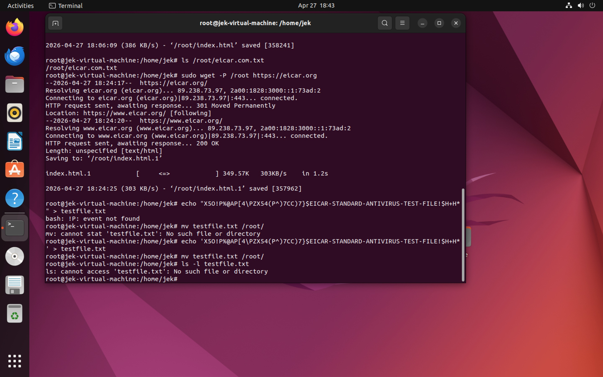
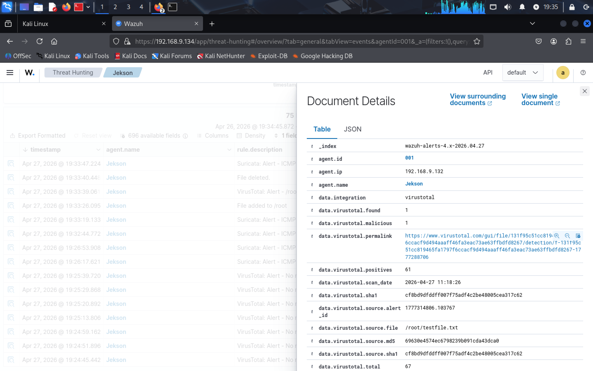
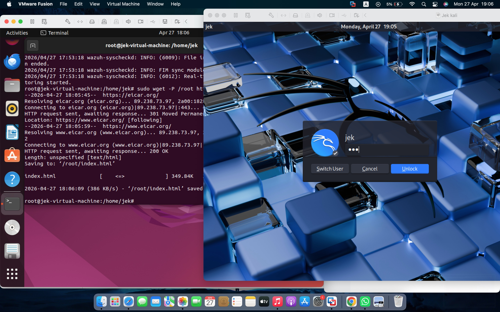
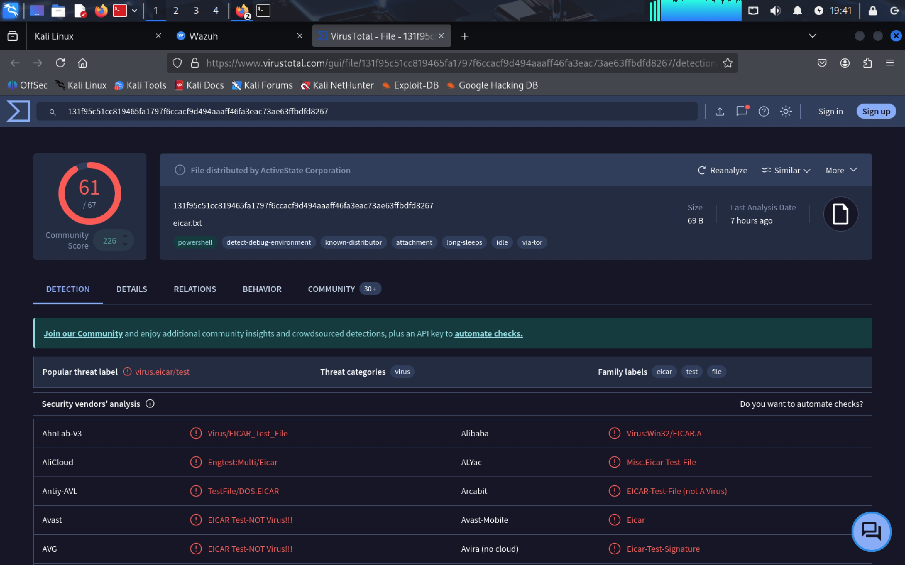
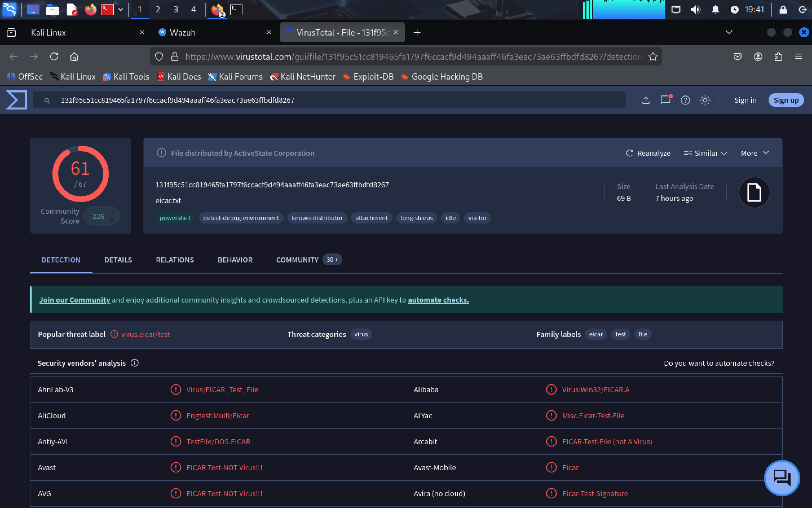
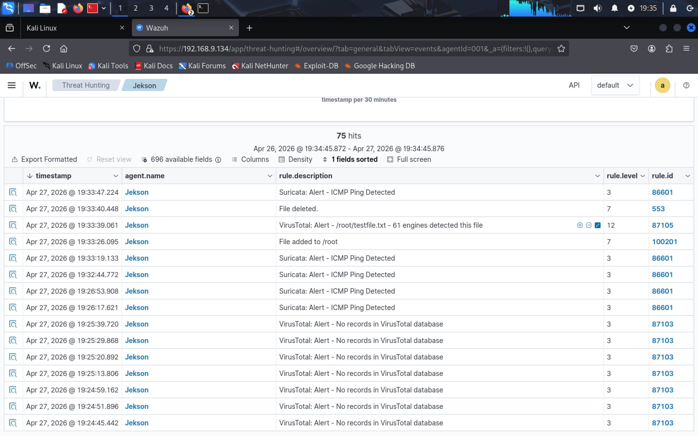

# Suricata-Wazuh Threat Detection & VirusTotal Integration Lab

## Overview
This project demonstrates the integration of Suricata IDS, Wazuh SIEM, and VirusTotal threat intelligence on Kali Linux for real-time threat detection and centralized security monitoring. The lab was designed to simulate a Security Operations Center (SOC) monitoring environment where network traffic is analyzed, suspicious activity is detected, and alerts are monitored through Wazuh.

---

# Technologies Used
- Kali Linux
- Suricata IDS
- Wazuh SIEM
- VirusTotal
- GitHub
- VS Code

---

# Features
- Intrusion Detection
- Security Monitoring
- Alert Analysis
- Threat Intelligence Integration
- Real-Time Monitoring
- Log Analysis

---

# Project Workflow
```text
Network Traffic
      ↓
 Suricata IDS
      ↓
  Alert Logs
      ↓
    Wazuh
      ↓
Threat Monitoring
      ↓
VirusTotal Validation
```

---

# Installation Process

## Install Suricata
```bash
sudo apt update
sudo apt install suricata -y
```

## Start Suricata
```bash
sudo systemctl start suricata
sudo systemctl enable suricata
```

## Check Service Status
```bash
sudo systemctl status suricata
```

---

# Wazuh Integration
Wazuh was configured to monitor Suricata alert logs for centralized event analysis and security monitoring.

---

# VirusTotal Integration
VirusTotal was used for additional threat intelligence validation and suspicious indicator analysis.

---

# Screenshots
Project screenshots are located inside the `screenshots/` folder, providing visual evidence of the detection and monitoring workflow.

### 1. Lab Environment & Threat Simulation
*Setting up the environment and generating alerts through the terminal.*



### 2. Wazuh SIEM Monitoring
*Centralized alert management and real-time dashboard monitoring.*



### 3. Threat Intelligence & Log Integration
*Validating threats via VirusTotal and checking integration logs.*



---

# Challenges Faced
- Wazuh manager timeout issues
- Log forwarding troubleshooting
- Service configuration issues
- Alert monitoring setup

---

# Lessons Learned
- IDS monitoring
- SIEM integration
- Linux troubleshooting
- Threat detection workflow
- Security monitoring

---

# Future Improvements
- Add custom alert rules
- Integrate ELK Stack
- Implement automated alerting
- Expand threat intelligence feeds

---

# Author
**Cybersecurity Student & SOC Analyst Enthusiast**
Focused on:
- Threat Detection
- Security Monitoring
- Incident Response
- Blue Team Operations
